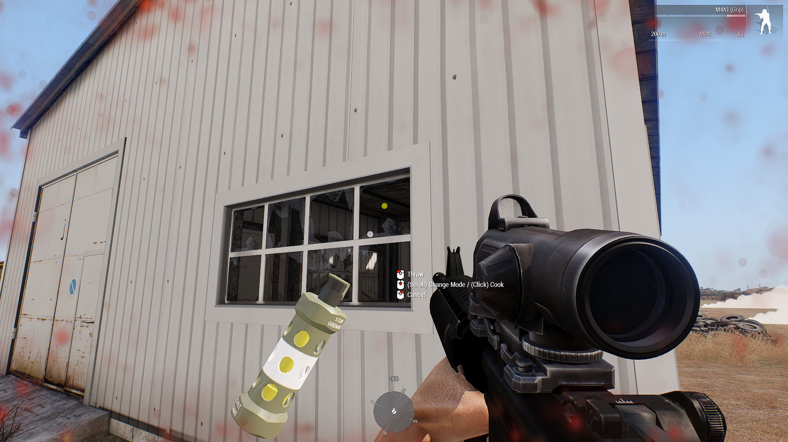
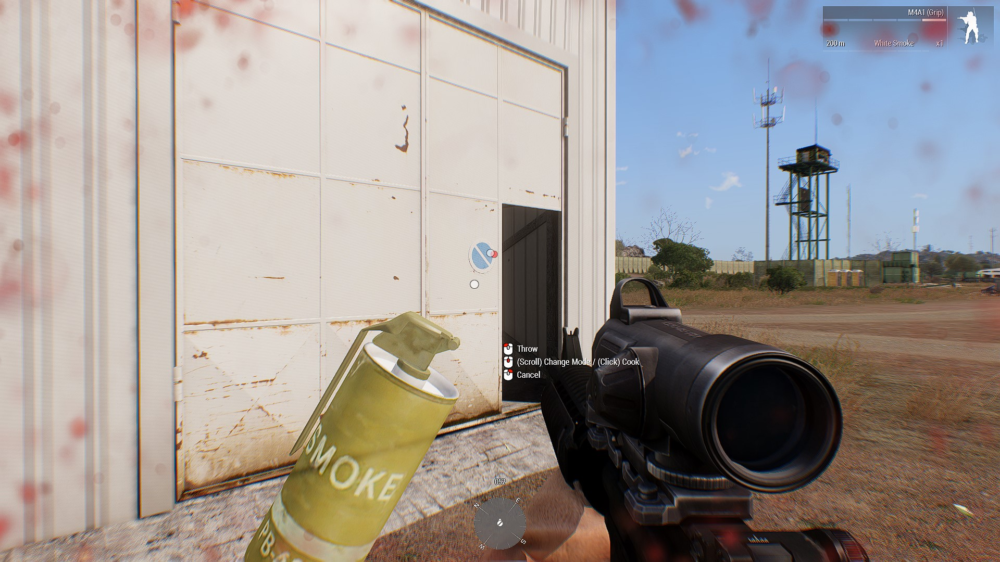

# Hand Grenade Guide

## Role Description

All operators should be expected to familiarize themselves with the use of hand grenades.

## Specialized Equipment

Completing the certification for hand grenades will unlock the usage of fragmentation grenades as well as stun grenades.

## Usage

### Callouts

Every time you toss a grenade, a call should be made over proximity voice. The call should be in the format:

> [Frag|Stun|Smoke] out. [Direction]

Examples:

> Frag Out! North!
> Stun Out! South-East!  
> Smoke Out! West!

The call out should not slow down your ability to respond to threats. At a minimum you must always call out "[Grenade Type] Out!"

If the employment of the grenade fails, the thrower should immediately alert the other operators in his vicinity. When calling a bad grenade toss, the direction **must** be included in the call.

Example:

> Bad 'nade! South West!
> Bad frag! North!
> Bad stun! East1

### Risks of Use

When throwing fragmentation grenades, you need to know the impact radius and fragmentation radius to maximize injury on the enemy and reduce friendly injuries.

The approximate lethality of an M67 fragmentation grenade is:

- 5m - Deadly
- 15m - Casualty radius
- 230m - Fragmentation radius (shrapnel can disperse up to this far.)
- 35m - Range an average soldier can throw

Regardless of range there is always a chance of being hit by a piece of shrapnel.
Due to this risk, proper employment should always consist of throwing the grenade and immediately seeking cover.

#### Vehicles

It is possible for fragmentation grenades to disable civilian or unarmored vehicles, however, they would need to be right on top of the grenade.
It is best practice to exhaust all other means of disabling a vehicle before attempting to throw a frag.

#### Buildings

Fragmentation and stun grenades are most effective when used in enclosed spaces due to the overpressure of the enclosed area along with the shrapnel caused by the fragmentation.
A stun or fragmentation grenade should be chosen accordingly based on whether non-combatants are inside of the room/building.
If they are a stun is preferred.

### Grenade Types

- Fragmentation (M67)
  - Also known as 'frags'
  - Fuze time of 4 - 5 seconds

- Stun (M84)
  - Also known as a 'stun'
  - Fuze time of 1 - 2 seconds

- Smoke (M18)
  - Comes in a variety of colors. White is typically used as a screen, while colored smokes are used to mark positions
  - Fuze time of 1 - 2 seconds
  - Lasts 60 seconds

- Chemlights
  - Deploys immediately
  - Used to mark cleared rooms or cleared areas at nighttime

### ACE Throwing

ACE throwing makes grenades easier to use in Arma 3.
Two additional keybinds are added in two different modes to assist with grenade usage, as well as a HUD element.

Operators should always endeavor to use ACE Throwing as it allows for more accurate employment of the weapons.
When throwing a grenade through a window, the operator should ensure the window is broken first. Otherwise the grenade will not go through and instead bounce back at the operator's feet. 

#### Keybinds

- Shift + G
  - Pulls up ACE throwing. You will see the current grenade type, as well as a small keymap along with multiple dots in an arc fashion.
  - The dots represent the path of the grenade.
  - If a dot is green it means the grenade is expected to his the ground at the green dot.
  - If a dot is yellow it means the dot will encounter be going through a closed space and may hit a ledge and change direction (like a window or doorway).
  
  - If a dot is red, it means that at that point in the arc the grenade will encounter a hard object and not be able to pass (like a wall).
  

- Keybinds from here:
  - Shift + G - Cycle through grenades
  - LMB - Throw the grenade
  - RMB - Cancel and back out of the menue
  - MMB (Scroll) - Change the arc/throw distance
  - MMB (Click) - Pull the pin and release the spoon, 'cooking' the grenade. This is very dangerous and the operator should be aware of the grenades approximate fuze times.
  - Ctrl + G - Changes the throw mode to a drop. Useful if you have a broken window and just want to drop the grenade on the other side. Or if you want to drop the grenade down a hatch at your feet.
